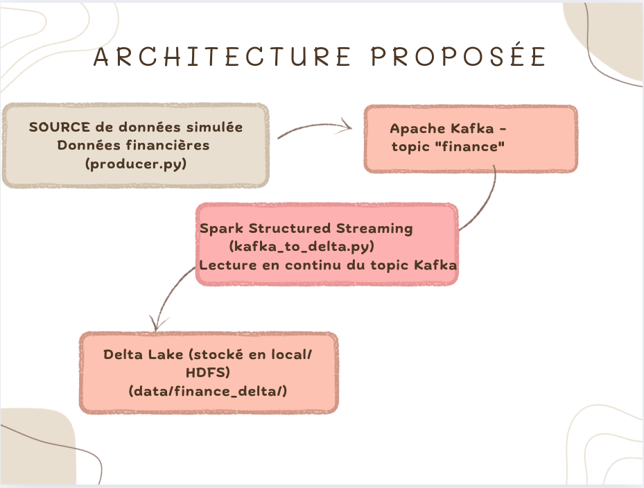

###                                               FinanceLake – Mini-Projet d'Ingestion de Données 

Objectif

Ce projet a pour but de mettre en place une architecture d'ingestion de données en temps réel, en simulant des données financières, afin de les stocker dans un Data Lake (Delta Lake) pour une analyse ultérieure.

 Architecture Proposée

 Cette architecture suit une approche moderne orientée streaming pour assurer une ingestion rapide, fiable et évolutive.

Justification des choix technologiques

Apache Kafka : Utilisé comme broker de messages pour transporter des événements en temps réel. C'est un système scalable, décentralisé et hautement performant.

Spark Structured Streaming : Permet de consommer les données de Kafka, de les transformer et de les stocker en continu. Sa compatibilité native avec Kafka et Delta Lake en fait un excellent choix pour le traitement de flux.

Delta Lake : Fournit une couche de stockage transactionnelle (ACID) sur les fichiers Parquet. Il permet une gestion fiable et versionnée des données dans un Data Lake.

Producteur Python simulé : Une source de données simple pour simuler un flux continu de valeurs boursières.

Fonctionnement

1. Lancer Kafka (assumé comme déjà configuré)

Démarrer Zookeeper puis Kafka :
# bin/zookeeper-server-start.sh config/zookeeper.properties
# bin/kafka-server-start.sh config/server.properties
Créer le topic "finance" :
# bin/kafka-topics.sh --create --topic finance --bootstrap-server localhost:9092 --partitions 1 --replication-factor 1

2. Exécuter le producteur
# cd ingestion-kafka/producer
# python3 producer.py

Cela envoie des messages de la forme :  
> {"symbol": "AAPL", "price": 174.5}

3. Lancer Spark Structured Streaming
# cd ingestion-kafka/spark
# spark-submit kafka_to_delta.py
Les données seront stockées dans data/finance_delta/ au format Delta Lake.

🚀 Auteur

Nom : Amina ELBAYYADI
Formation : Master Big Data & Intelligence Artificielle