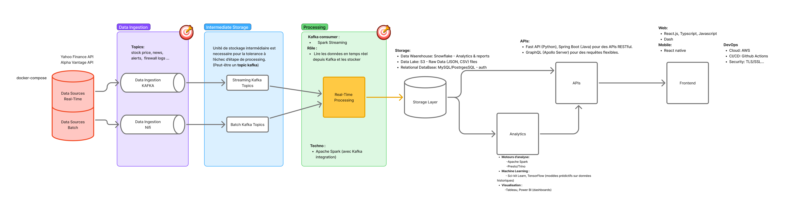

#  FinanceLake – Big Data Architecture

> *This architecture was collaboratively designed by all members of the class as part of our Big Data project work.*

This documentation describes the technical architecture of **FinanceLake**, an open-source platform for ingesting, analyzing, and visualizing financial data.

---

##  Architecture Overview

This architecture is designed to support:
- both **real-time and batch** data flows
- **scalable data processing**
- **fast data querying and visualization**
- **cloud-native deployment and automation**

---

##  Data Pipeline

###  1. **Data Sources**
- **Real-time APIs**: Yahoo Finance API, Alpha Vantage API
- **Batch sources**: CSV files, historical market datasets
- **Docker Compose** is used for local orchestration

---

###  2. **Data Ingestion**

| Tool        | Role                                  |
|-------------|----------------------------------------|
| **Kafka**   | Real-time financial data ingestion     |
| **Apache NiFi** | Batch ingestion and complex pipelines |

--> Data is published to different **Kafka topics** depending on the type: `stock_prices`, `news`, `alerts`, etc.

---

###  3. **Intermediate Storage**
- Kafka topics serve as **temporary buffers**:
  - `Streaming Kafka Topics`
  - `Batch Kafka Topics`
- This layer provides **fault tolerance** and **decoupling** between ingestion and processing.

---

###  4. **Processing Layer**

| Component          | Description                               |
|--------------------|-------------------------------------------|
| **Spark Streaming** | Consumes Kafka messages in real-time     |
| **Apache Spark**    | Transforms, cleans, and prepares data    |

---

###  5. **Final Storage**

Processed data is stored across multiple storage layers:

-  **Data Warehouse**: Snowflake (aggregated reports and analytics)
-  **Data Lake**: S3 (raw JSON/CSV files)
-  **Relational DB**: MySQL/PostgreSQL (authentication, metadata)

---

###  6. **APIs & Visualization**

- REST APIs via **FastAPI (Python)** and **Spring Boot (Java)**
- **GraphQL (Apollo Server)** for flexible queries
- Web & mobile dashboards:
  - Web: React.js, Dash
  - Mobile: React Native

---

##  Analytics & Machine Learning

- **Analytics Engines**:
  - Apache Spark
  - Presto / Trino
- **Machine Learning**:
  - scikit-learn, TensorFlow (predictive modeling)
- **Visualization**:
  - Tableau, Power BI

---

##  DevOps & Cloud

- **Cloud**: AWS
- **CI/CD**: GitHub Actions
- **Security**: TLS/SSL

---

##  Conclusion

This modular architecture ensures:
- support for **large-scale data ingestion**
- **low-latency** analytics
- easy **scalability** for future enhancements

---

**Made with collaboration and teamwork by all students in our Big Data class.**
