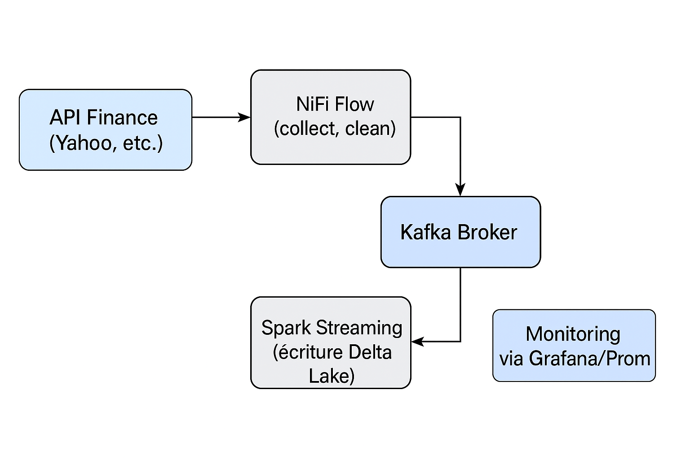

# 🧩 Architecture proposée pour l’ingestion des données (Issue #36)

## Objectif

Construire un pipeline d'ingestion temps réel des données financières basé sur Kafka et NiFi.

## Outils utilisés
- Apache NiFi : Extraction + transformation
- Apache Kafka : Streaming
- Spark : Traitement
- Delta Lake : Stockage

## Architecture

## Étapes du flux

1. Requête API via NiFi
2. Nettoyage et formatage JSON
3. Publication sur topic Kafka
4. Spark consomme Kafka et stocke dans Delta Lake

## Avantages

- Scalable
- Modulaire
- Open source
