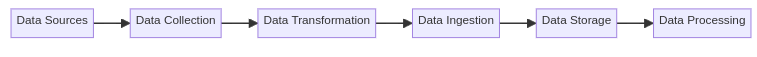
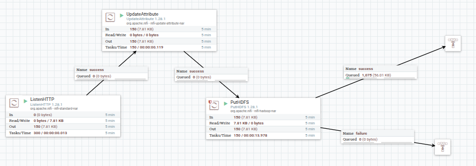

#  Data Ingestion Architecture using Apache NiFi and HDFS

##  Goal

Build a reliable pipeline to ingest real-time stock market data using **Apache NiFi** and store it in the **Hadoop Distributed File System (HDFS)**.

##  Components

 Data Producer :  `stock-producer.py` 
 Ingestion Tool : Apache NiFi    
 Storage System : Hadoop HDFS 

**Data Producer:** stock-producer.py is the source of the data , it simulates or sends stock data (like a stream). it acts like our “sensor” or data generator that  gernerates data in a real-time.

**Data Ingestion Tool:** we're using Apache NiFi as  our ETL tool (Extract → Transform → Load). It listens to data (via HTTP or TCP), optionally transforms it, and sends it to storage.wich is in our case is hadoop hdfs.

**Storage Layer:** we’re storing the data in HDFS (Hadoop Distributed File System), which is perfect for large-scale storage. it also uses the data-locality concept wich is a great thing for the next step wich is data processing ( using mapreduce - spark - hive... ) 

##  Data Flow :

Data Producer → NiFi (ETL) → HDFS (Storage)

## Apache NiFi Dataflow

This project uses an Apache NiFi flow for ingesting, processing, and storing stock data.

### Flow Summary:
- `ListenHTTP`: Receives real-time JSON data from a Python producer.
- `UpdateAttribute`: Adds a dynamic filename.
- `PutHDFS`: Stores the data in HDFS.

### Files:
- `nifi-template/stock-dataflow.xml`: NiFi template to import the flow.
- `nifi-template/flow-diagram.png`: Screenshot of the NiFi architecture.

1. **ListenHTTP Processor** : Listens for incoming HTTP requests on port 8090 to receive stock data

2. **UpdateAttribute Processor** : Adds/modifies attributes to the flow files (in this case, sets a dynamic filename to: stock_${now():format("yyyyMMddHHmmssSSS")}.json ) This creates a timestamped filename for each incoming data file

3. **PutHDFS Processor** : Writes the data to Hadoop Distributed File System (HDFS)
Hadoop Configuration Resources: /home/zangati/Downloads/hadoop-3.4.1/etc/hadoop/core-site.xml

4. **Connections** : The processors are connected in this sequence:

* ListenHTTP → UpdateAttribute (success relationship)

* UpdateAttribute → PutHDFS (success relationship)

PutHDFS has two outgoing connections:

* success → Funnel (id: 77836c21...)

* failure → Funnel (id: c557c509...)

5. **Funnels** : Two funnels are used to collect:

* Successful outputs (from PutHDFS success relationship)

* Failure outputs (from PutHDFS failure relationship)

The workflow is designed for real-time data ingestion of stock data 

A Python script (stock-producer.py) would be sending data to the ListenHTTP endpoint

The data is stored in HDFS with timestamped filenames

The entire flow is running continuously (scheduling strategy is TIMER_DRIVEN with 0 sec period)

This pipeline provides a simple but effective way to ingest real-time stock data into HDFS for further processing or analysis.

## Next Steps

After ingesting the data into HDFS, it can be processed using distributed computing tools such as Apache Spark, MapReduce, or Hive, depending on the analysis or transformation needs.

